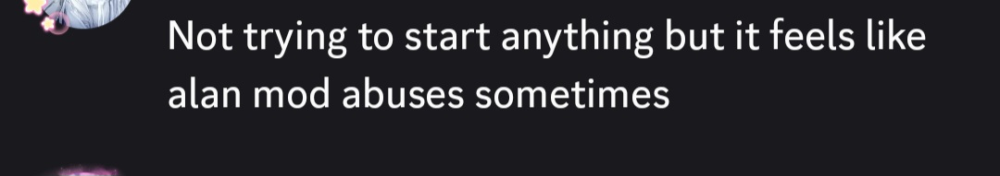
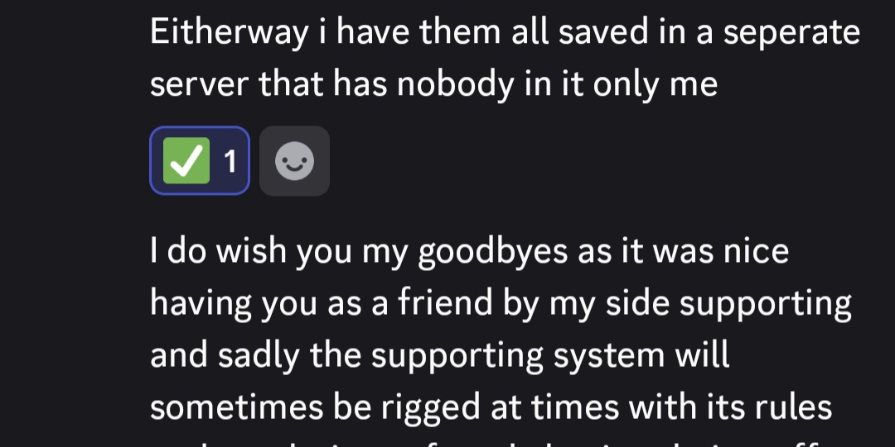
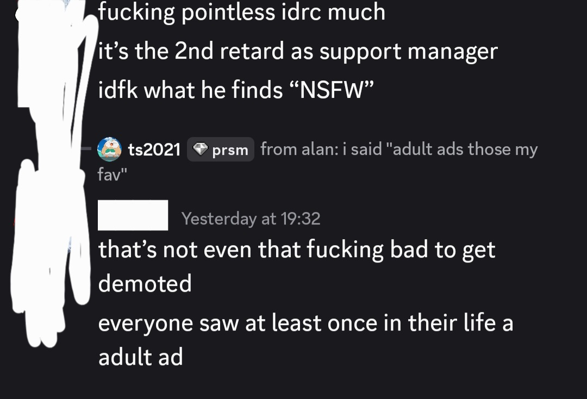

# Delta Executor - SHIT Support 
The Support Manager and Moderator, Alan, should not have the roles he has. I have deleted all my solutions from the server, as all actions, such as him demoting me for NSFW, have consequences.

If you want to see exactly what I did to get demoted, press this link. Then, you will witness Alan's ignorance and idiocy:
https://gofile.io/d/iBEMXeSa

Advertisement from nyxolz:
[the best discord not prism i promise](https://discord.gg/PFqKfZSGAe)

He also likes having fun removing and re-adding roles from us, and being a negative guy in general.

nyxolz has never done that, and despite her flaws, is still much better than him. Unfortunately, she's kept him on the team (maybe not on her own accord).

**Do not repost my guides in the #solutions channel. Do that, and I will get them taken down.** And before you say, "oh it isn't serious", I'm literally in the top 10 for this server. Alan is ABOVE me. He's the DISCORD MOD, he's the bum, not me.

And let's mention Ylem. He's the guy who updated the support application to have ZERO questions about Delta troubleshooting. Some of the Trials chosen are rather stupid, and it probably would not happen if the support application was actually good (the old one was much better).

Let me show you the current Support List and their contributions:
- carlitos (the only good, active one)
  0 contributions to #solutions
- koda (job; not that active)
  0 contributions to #solutions
- tea (job; not that active)
  0 contributions to #solutions
- track33 (active once; now really inactive)
  3 contributions to #solutions
- King (random guy)
  0 contributions to #solutions
  
There are a couple from nyxolz and alan too, as well as some Supports that are now demoted. However, that's really all.

I became Support to fix the rotten #solutions channel (since it was missing a ton of information, and some had terrible wording/were unclear). But I got demoted over a 5-word message. Wow. 
I also got called a chud by Alan for making so many solutions, and although yes, it looked ridiculous, most, if not all, of my solutions had a purpose.

I find it funny that it is called the Delta "Community" server when it is more like the Delta "Support" server. Apparently, it is better for us to only help and do nothing else. Otherwise, we get warnings for rule 1 (being even a tiny bit disrespectful/impolite when most of the people talking are idiots).

Rule 1 is enforced because Phxyzn has authority over nyxolz. Phxyzn is barely active nowadays, and the last time he was online, he started to larp as an e-girl. Very professional. Who's the actual NSFWer?

Here are three screenshots (one Support, one former Support, one Trial Support) that share my opinion. You may be able to guess who they are, but I will not be the one telling you that!

Here is another Support stating that my solutions helped them. This applies to many others:

<!-- ylem got dementia or smth (or on purpose?) cuz he forgot to unwhitelist me from delta testing apk website lmao -->
