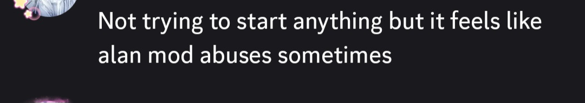
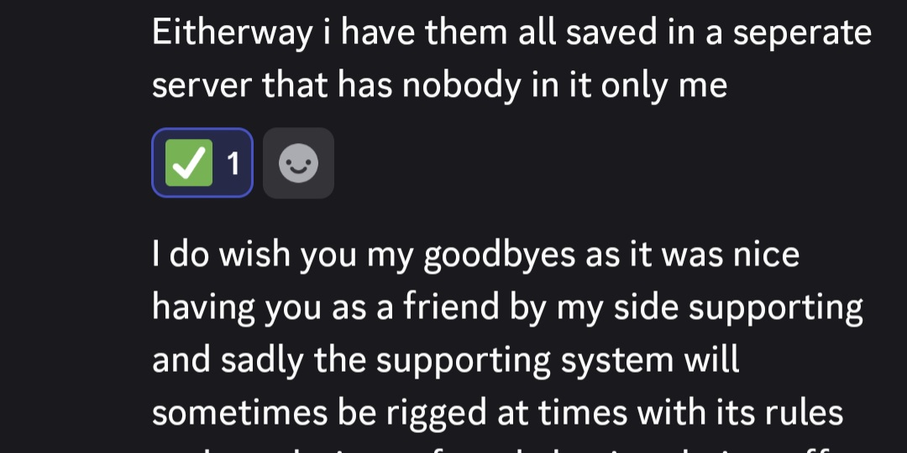
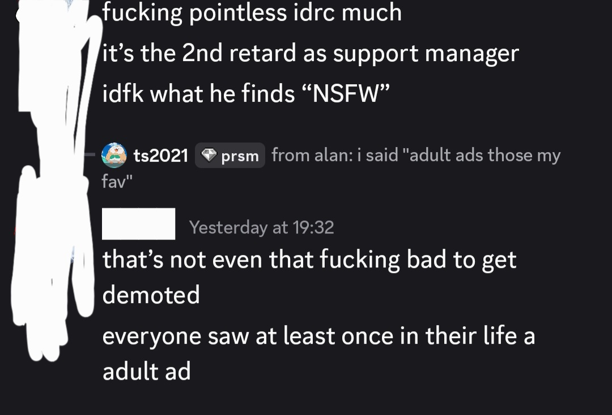

# Delta Executor - Internal Hell 
I was a Support for the Delta Community Discord server between 1st July 2026 to 14th September 2026. However, I had been helping with Delta since January 2026. I had also helped in the Krnl server before that since mid 2025 (until it got discontinued in late 2025). The manager (whoise) even asked me for help once. I have made this README.md to discuss the administration of the Delta server - specifically, why it isn't good.

## 1. Alan

Alan was a Support Manager and Moderator of the server, up until 7th October 2026. I believe he should not have had the roles he had.

I got demoted for "NSFW". If you want to see exactly what I did to get demoted, press this link. Then, you can also witness Alan's ignorance and idiocy: https://discord.com/channels/1279547031945220147/1294274202320244777/1558141382386786335

Alan tried to deflect by showing how nyxolz agreed with him (she is a senior mod; his superior), but that's because she's busy with [Prism](https://discord.gg/prismmacos) and doesn't check Delta that much. Alan KNOWS that.

NOTE: Shortly after he demoted me, I decided to delete all my solutions from the Delta Community server, as all actions, such as him demoting me for NSFW, have consequences. Please don't repost my stuff in #solutions without my permission.

Alan also liked having fun removing and re-adding roles from us, and being a negative guy in general. He thinks he's the "goat" and that he's not a chud like the rest of us. But I mean... he was a moderator. And he stayed on the moderation team for THREE WEEKS before actually getting removed. Despite him supposedly quitting, he joined on his alt and said some nice stuff like the following...

nyxolz unfortunately decided to keep him on the team, which I was a bit pissed about, but I found out that it was not on her own accord (ylem and phxyzn are superiors to her).

Here are three screenshots (one Support, one former Support, one Trial Support) that share my opinion. You may be able to guess who they are, but I will not be the one telling you that! <!-- first image is probably bias; solstice supports pedophiles -->

One of the other senior moderators (Reflex) was also a little suspicious of Alan too, but didn't make it that clear. They quit at the same time as Alan.

## 2. Ylem
Ylem is the manager of the server. He's the guy who updated the support application to have ZERO questions about Delta troubleshooting. Some of the Trials chosen are rather stupid, and it probably would not happen if the support application was actually good (the old one was much better). What a genius:

Nyxolz also stated the following "everyone who applies is mostly an idiot or underage due to these preschool applications ♥️ (for example, deltauser/catlover04963 and most trials)"

Ever since ylem created a Support Application channel (shortly after my demotion), lots more people were promoted. Luckily, they were helping rather well! Or were they? Turns out half of them got a warning for not doing enough proofs. A bunch ended up getting demoted. Also, despite there being 20 Supports, support forums are occasionally void of helpers.

## 3. The Support Team - Shrinkage and Stupidity
Over time, I have also noticed that the Staff Team has been getting smaller, or perhaps fewer people are getting promoted to Support (or getting Trial Support in the first place). Either Delta is dying, not enough selections are happening, or the selections are just shit.

Let me show you the current (non-Trial) Support List and their contributions:
- Parrot emoji guy (knows good stuff about sideloading)
  - 1 contribution to #solutions
- Dark
  - 1 contribution (his solution is one I found; not sure if it's independent, but let's say he found it himself)
- track33 (now moderator. They were active once, but are now quite inactive)
  - 3 contributions to #solutions
- carlitos (now moderator)
  - 6 or so contributions (once I got demoted and deleted my solutions, he started adding them to replace them. Maybe inspired by mine)
- Every other support has made no contributions
  
There are a couple from nyxolz and alan too, as well as some Supports that are now demoted. However, that's really all. I made about 30 in
total whilst I was a support.

I became Support to fix the #solutions channel (since it was missing a ton of information, and some had terrible wording/were unclear). Many Supports used my solutions, as they weren't shit. My solutions may have helped them to not get demoted, even. However, I won't say it like that's the gospel, as I'm not trying to be a narcissist.

Here is another Support stating that my solutions helped them. This applies to many others:

A Support who tried to repost my guide without credit and also clearly didn't double-check it, as it contained a link to https://ksign-installer.vercel.app, which has a link to my website:

I pretended to need help installing Delta Android. This support thought to get it; I had to use ksign (iOS only, by the way). He got told by phxyzn that I was trolling, as he didn't realise. I have no idea where he was getting his Delta Android installation steps from...

He is recommending turning off Wi-Fi when he is on an iPad?

## 4. Support Dictatorship, Bias and Impossible Promotions
I find it funny that it is called the Delta "Community" server when it is more like the Delta "Support" server. Apparently, it is better for us to only help and do nothing else. Otherwise, we get warnings for rule 1 (being even a tiny bit disrespectful/impolite when most of the people talking are idiots).

Rule 1 is enforced because Phxyzn has authority over nyxolz. Phxyzn is barely active nowadays, and the last time he was online, he started to larp as an e-girl. Very professional. Who's the actual NSFWer? 

Did you know that promotions are stupid? Here's why:
- You can't get promoted from support to moderator, as there's a maximum of three (same with senior).
- **No matter how good you are**, **no matter how active you are**...
- you need to keep **slaving** away
- Just remember that this is a server with nearly a million accounts (probably botted, though)
- I am sure that for most servers, there isn't a limit for promotions

Two of the mods (warxr and coolaid/colaid) did not even have any staff role for months. They just randomly got promoted sometime in July straight to Moderator as there were spots. I personally think that mods who don't care about Delta should not have the role.

Don't worry, though, it gets worse. Phxyzn and Ylem clearly have some bias towards women:
- Koda (a former support) got promoted from trial support to support in 2 days
- It's supposed to be 2 weeks (even though I was really active, I went through the same)
- When she quit, she got the "retired staff" role, when no other retired staff got one.
- Layla kept getting her support role back just by asking
- atedrvgs (<3) was able to stay as support after several chances

nyxolz should have a promotion, but that won't happen. The maximum is Senior Moderator unless you're friends with mlemix. Or Ylem, as Phxyzn is Staff Manager.

nyxolz said the following: i agree i should be higher, i already lock/unlock some channels and fix perms as well as promoting/demoting staff like i demoted alan and promoted reflex to senior kinda (it was my choice either sen or reflex so i already make those decisions, just make me staff manager or admin atp) 

Here's some more information about Alan. Before Alan quit, he was actually considered to be a senior moderator by Ylem. Ridiculous:

Alan, when he got demoted, got to have the "Retired Staff" role too. However, he ended up leaving the server (before rejoining on his alt account).

## 5. The Present State
Carlitos replaced him as moderator (which is fine; he is actually passionate), and warxr was given senior mod. As for why him over coolaid, I do not know. He has sent even fewer messages than coolaid (but both aren't that active). Track33 is also a moderator and support manager now (Track33 should hopefully be better than Alan; not that active, but not acting inappropriately).

# Nyxolz's summarisation
- delta is dead (chat is drier by the day)
- ownership is crazy
- everyone is inactive or has quit
- support team is dead
- ylem isn't really active and doesn't do much, same with phxyzn

This file was created on 17th September 2026.
Created by ts2021, with nyxolz contributions too

<!-- ylem got dementia or smth (or on purpose?) cuz he forgot to unwhitelist me from delta testing apk/ipa website lmao -->
<!-- delta-testing.net is link -->
